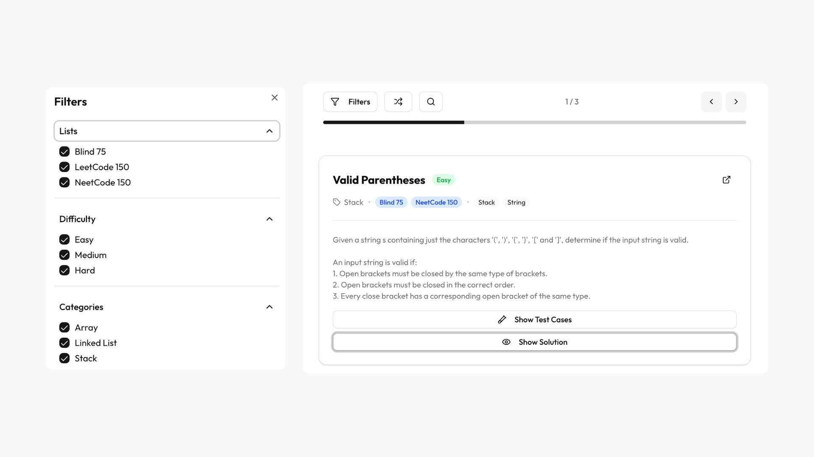
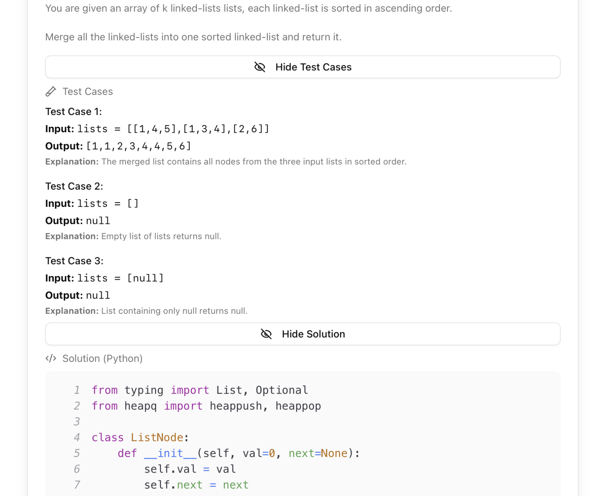

# DSA Flashcards

These flashcards were based on solutions created by myself, Daniel and Alex.
The original solutions are preserved on the `solutions` branch.
They are now being integrated into this Nextjs Site slowly.

## Screenshots




## Getting Started

First, run the development server:

```bash
npm run dev
```

Open [http://localhost:3000](http://localhost:3000) with your browser to see the result.
